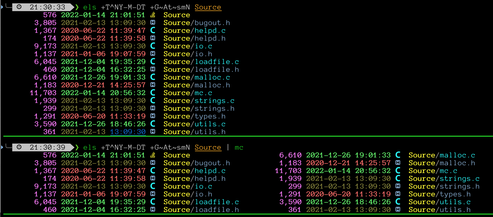

# mc - multi-column

Rewrite stdin into multi-column output

## Usage

usage: mc [-:bc:m:sd:Sw:uh1] [FILE] 
Print stdin in multiple columns 
 
  -b : (False) Only columnate to avoid scrolling 
  -s : (False) Strip escape codes from stdin 
  -S : (False) Strip and print 
  -w   (  163) Override COLUMNS 
  -m   (    5) Set minimum lines to split 
  -c   (    3) Set spacing between columns 
  -d  [0x0000] Debug level:
               use 0x0200 to invoke malloc_debug
 
 
For better results: 
  - export COLUMNS LINES 
  - export MC_MIN  # set minimum lines to split 
